# Hi there, I'm Quy Huynh! 👋

> 🤣 **From Silicon to Pixel: OSDev, Reverse Engineering & Full-stack Apps.**

A naturally curious person who enjoys exploring and understanding how things work. I’m passionate about **web development**, **mobile applications**, and **system programming**. In addition, I have a strong interest in researching and developing **custom firmware** for various devices.

I'm studying at CTU<3

---

### 💻 Tech Stack

**Core & Systems**

**Application & Web**

**Tools & Research**

---

### 📊 GitHub Stats

  

---

### 📫 Connect with me
* 💼 Email: fwy13@duck.com
* 📝 Research Notes / Blog: https://fwy13.github.io

