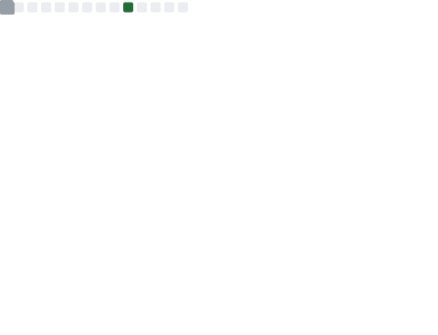

# Hi there, I'm Quy Huynh! 👋

I really love the **Rust** programming language and I'm currently learning it. 🦀

> Learning IT in CTU.

---

### 💻 Tech Stack

**Core & Systems**

**Application & Web**

**Tools & Research**

---

### 📊 GitHub Stats

  

---

### 📫 Connect with me
* 💼 Email: fwy13@duck.com
* 📝 Research Notes / Blog: https://fwy13.github.io

