# 👋 Hi, I'm Quy Huynh
I am a student at Can Tho University. I love to explore everything, can you share with me some interesting things via email?

📫: fwy13@duck.com.

  
  

### 💻 I use

- **📱 Mobile Apps:** Tauri (Rust), Kotlin.
- **🧰 Web:** React, Vue, Svelte.
- **📞 Api:** Express, Koa.

---

### 🛠️ Technology

- **Programming Language:** Rust, Kotlin, TypeScript, JavaScript, C++
- **IDE:** VS Code, Nvim, CodeBlock
- **Env:** Arch-Base with Hyprland, Window

  

